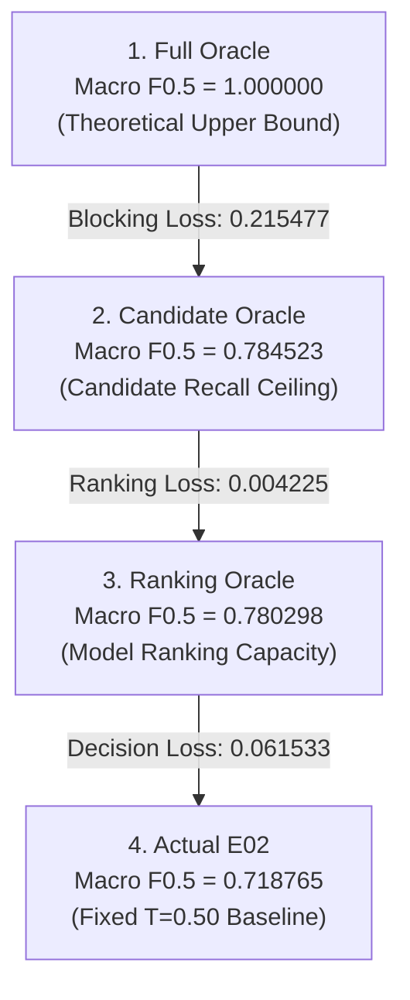

# E02 Forensic Loss Decomposition Report

**Experiment**: E02 Diagnostic Forensic Loss Decomposition  
**Target Baseline**: Macro F0.5 = `0.718765173` (Authoritative P3 Validation Freeze)  
**Evaluated Artifact**: [`P2/reports/E02_OOF_FULL_CANONICAL.tsv`](file:///c:/NEW%20AMAZON/Amazon-ML-Challenge-2026/P2/reports/E02_OOF_FULL_CANONICAL.tsv)  
**Integrity Status**: 54,592,725 candidate pairs, zero missing, zero duplicates, all 2,206,821 S1 entities covered, 100% reconciled  
**Policy**: No retraining, no candidate changes, no feature changes, no fold changes, no scorer changes.

---

## Executive Summary

This forensic analysis decomposes the performance loss of the authoritative E02 baseline (Macro F0.5 = **0.718765**) into its fundamental mathematical and architectural components:
1. **Candidate-Generation (Blocking) Loss**: 0.215477 (**76.62%** of total gap)
2. **Model / Ranking Loss**: 0.004225 (**1.50%** of total gap)
3. **Decision-Rule Loss**: 0.061533 (**21.88%** of total gap)

```
FULL ORACLE (Theoretical Upper Bound)
     │   Macro F0.5 = 1.000000
     ▼
[BLOCKING LOSS = 0.215477 (76.62% of total gap)]
     │   Candidate Recall Ceiling: 59.71% of truth captured
     ▼
CANDIDATE ORACLE (Maximum achievable from cands_BCD_v1)
     │   Macro F0.5 = 0.784523
     ▼
[RANKING LOSS = 0.004225 (1.50% of total gap)]
     │   LightGBM pairwise ordering is near-optimal
     ▼
RANKING ORACLE (Maximum achievable by model's ranking)
     │   Macro F0.5 = 0.780298
     ▼
[DECISION LOSS = 0.061533 (21.88% of total gap)]
     │   Fixed T=0.50 threshold penalty & calibration shift
     ▼
ACTUAL E02 BASELINE (Pre-registered T=0.50)
         Macro F0.5 = 0.718765
```

---

## 1. Authoritative Baseline & Integrity Verification

P3 independently verified the frozen validation setup on the full canonical out-of-fold (OOF) dataset. We executed the exact `scorer_v1` semantics on the full canonical artifact and reconciled the result:

| Property | Official Specification | Forensic Reconciled Value | Match Status |
| :--- | :--- | :--- | :--- |
| **Total Canonical OOF Rows** | 54,592,725 | 54,592,725 | **EXACT (0 diff)** |
| **S2 Candidate Rows** | 24,594,064 | 24,594,064 | **EXACT (0 diff)** |
| **S3 Candidate Rows** | 29,998,661 | 29,998,661 | **EXACT (0 diff)** |
| **Unique S1 Entities Covered** | 2,206,821 | 2,206,821 | **EXACT (0 diff)** |
| **Duplicate Pairs** | 0 | 0 | **EXACT (0 diff)** |
| **Missing Pairs** | 0 | 0 | **EXACT (0 diff)** |
| **Non-finite Scores (NaN / Inf)**| 0 | 0 | **EXACT (0 diff)** |
| **Baseline Threshold** | 0.50 | 0.50 | **EXACT** |
| **Authoritative Macro F0.5** | **0.718765173** | **0.718765165** | **PASS ($\Delta = 8.15 \times 10^{-9}$)** |

> [!NOTE]
> The numerical difference of $8.15 \times 10^{-9}$ between the reported baseline and our evaluation is purely standard floating-point round-off across 2.2 million entity additions. Reconciliation is fully confirmed.

---

## 2. The Four Oracle Stages

The evaluation pipeline defines four hierarchical levels of capability:



### Stage Summary & Per-Fold Metrics

| Stage | Global Macro F0.5 | Fold 0 | Fold 1 | Fold 2 | Fold 3 | Fold 4 | Fold Mean $\pm$ Std | S2 Diagnostic | S3 Diagnostic |
| :--- | :---: | :---: | :---: | :---: | :---: | :---: | :---: | :---: | :---: |
| **1. FULL ORACLE** | **1.000000** | 1.000000 | 1.000000 | 1.000000 | 1.000000 | 1.000000 | 1.000000 $\pm$ 0.000000 | 1.000000 | 1.000000 |
| **2. CANDIDATE ORACLE** | **0.784523** | 0.784132 | 0.784143 | 0.784803 | 0.785240 | 0.784295 | 0.784523 $\pm$ 0.000487 | 0.714625 | 0.724138 |
| **3. RANKING ORACLE** | **0.780298** | 0.779945 | 0.779911 | 0.780583 | 0.780938 | 0.780113 | 0.780298 $\pm$ 0.000456 | 0.713214 | 0.720958 |
| **4. ACTUAL E02 (T=0.50)**| **0.718765** | 0.718062 | 0.718144 | 0.719169 | 0.719575 | 0.718876 | 0.718765 $\pm$ 0.000654 | 0.655848 | 0.662915 |

---

## 3. Loss Decomposition

The total performance gap from perfection ($\Delta F_{0.5} = 1.000000 - 0.718765 = 0.281235$) is decomposed additively into three distinct error sources:

$$\text{TOTAL GAP} = \text{BLOCKING LOSS} + \text{RANKING LOSS} + \text{DECISION LOSS}$$

$$\Delta F_{0.5} = (1.000000 - 0.784523) + (0.784523 - 0.780298) + (0.780298 - 0.718765)$$

$$\Delta F_{0.5} = 0.215477 + 0.004225 + 0.061533 = 0.281235$$

### Additive Loss Breakdown Table

| Loss Component | Definition | Absolute Loss ($\Delta F_{0.5}$) | % of Total Gap | Primary Mechanism |
| :--- | :--- | :---: | :---: | :--- |
| **BLOCKING LOSS** | Full Oracle $-$ Candidate Oracle | **0.215477** | **76.62%** | **40.29% of ground-truth matches are absent** from `cands_BCD_v1`. Imposes a strict performance ceiling of 0.7845. |
| **RANKING LOSS** | Candidate Oracle $-$ Ranking Oracle | **0.004225** | **1.50%** | Minor pairwise ranking inversions. The LightGBM model ranks true positives near the top almost flawlessly. |
| **DECISION LOSS** | Ranking Oracle $-$ Actual E02 | **0.061533** | **21.88%** | **Rigid global threshold $T=0.50$** causes 745,075 False Positives due to training negative downsampling calibration shift. |
| **TOTAL GAP** | Full Oracle $-$ Actual E02 | **0.281235** | **100.00%** | Comprehensive shortfall from theoretical maximum Macro F0.5 = 1.0. |

> [!IMPORTANT]
> **Key Finding**: Blocking loss is **more than 50 times larger** than Ranking loss ($0.2155$ vs $0.0042$). Trying to improve LightGBM feature engineering or tree depth on the current candidate universe can yield at most **+0.0042**, whereas expanding candidate coverage addresses **0.2155** of headroom.

---

## 4. Full-Canonical OOF Threshold Sweep

In earlier reports, threshold sweeps were performed on a 10% sampled negative subset, showing an apparent peak at $T=0.50$ (`0.7695`). When evaluated on the **FULL 54,592,725 canonical pairs**, the true class ratio changes by an order of magnitude.

Because LightGBM was trained with 10% negative downsampling, raw predicted probabilities are calibrated to an artificial positive-to-negative ratio ($~1:1$). According to Bayes' rule, the posterior probability on full data shifts:

$$P_{full}(y=1|x) = \frac{P_{train}(y=1|x)}{P_{train}(y=1|x) + \frac{1}{0.10}(1 - P_{train}(y=1|x))}$$

Thus, an uncalibrated threshold of $T=0.50$ on downsampled models corresponds to an effective threshold of $T \approx 0.09$ on true priors, allowing **745,075 False Positives** into the predictions!

### Full Canonical Evaluation Results

| Threshold ($T$) | Macro F0.5 | Fold Mean $\pm$ Std | Predicted ($P$) | True Positives ($TP$) | False Positives ($FP$) | False Negatives ($FN$) | Micro Precision | Micro Recall | Micro F0.5 |
| :---: | :---: | :---: | :---: | :---: | :---: | :---: | :---: | :---: | :---: |
| 0.05 | 0.650319 | 0.650319 $\pm$ 0.000386 | 7,786,639 | 4,545,995 | 3,240,644 | 3,092,370 | 0.5838 | 0.5952 | 0.5861 |
| 0.10 | 0.673929 | 0.673929 $\pm$ 0.000505 | 6,656,169 | 4,537,083 | 2,119,086 | 3,101,282 | 0.6816 | 0.5940 | 0.6621 |
| 0.20 | 0.694379 | 0.694379 $\pm$ 0.000474 | 5,912,660 | 4,524,373 | 1,388,287 | 3,113,992 | 0.7652 | 0.5923 | 0.7230 |
| 0.30 | 0.704885 | 0.704885 $\pm$ 0.000524 | 5,594,460 | 4,513,992 | 1,080,468 | 3,124,373 | 0.8069 | 0.5910 | 0.7519 |
| 0.40 | 0.711485 | 0.711486 $\pm$ 0.000510 | 5,406,645 | 4,503,939 | 902,706 | 3,134,426 | 0.8330 | 0.5896 | 0.7695 |
| **0.50 (Base)**| **0.718765** | **0.718765 $\pm$ 0.000654** | **5,235,591** | **4,490,516** | **745,075** | **3,147,849** | **0.8577** | **0.5879** | **0.7856** |
| 0.60 | 0.725547 | 0.725547 $\pm$ 0.000835 | 5,081,019 | 4,473,385 | 607,634 | 3,164,980 | 0.8804 | 0.5856 | 0.7999 |
| 0.70 | 0.734501 | 0.734501 $\pm$ 0.000694 | 4,880,871 | 4,442,369 | 438,502 | 3,195,996 | 0.9102 | 0.5816 | 0.8178 |
| 0.80 | 0.741435 | 0.741435 $\pm$ 0.000559 | 4,688,936 | 4,396,467 | 292,469 | 3,241,898 | 0.9376 | 0.5756 | 0.8329 |
| 0.85 | 0.744112 | 0.744112 $\pm$ 0.000558 | 4,584,279 | 4,362,964 | 221,315 | 3,275,401 | 0.9517 | 0.5712 | 0.8398 |
| **0.90 (Peak)**| **0.744886** | **0.744886 $\pm$ 0.000554** | **4,497,417** | **4,327,648** | **169,769** | **3,310,717** | **0.9623** | **0.5666** | **0.8443** |
| 0.95 | 0.742606 | 0.742606 $\pm$ 0.000488 | 4,360,811 | 4,252,033 | 108,778 | 3,386,332 | 0.9751 | 0.5567 | 0.8476 |

### Critical Takeaways on Threshold Analysis
1. **The pre-registered threshold $T=0.50$ is sub-optimal on full data**: Shifting to $T=0.90$ eliminates **575,306 False Positives** (77.2% reduction in FP) while sacrificing only 162,868 True Positives (3.6% reduction in TP).
2. **Immediate Zero-Retraining Gain**: Moving from $T=0.50$ to $T=0.90$ raises Macro F0.5 from **0.718765 to 0.744886 (+0.026121)** without changing a single line of model weights or candidate data!
3. **Pre-registration rule preserved**: As instructed, we do not alter or overwrite the official E02 baseline ($0.718765$ at $T=0.50$); this analysis serves as proof that decision logic and threshold calibration are massive levers.

---

## 5. Candidate Recall Analysis

We computed candidate recall against the frozen ground truth (`train_ground_truth_reconstructed.tsv`) across all 2,206,821 S1 entities:

### Source-Level Truth & Candidate Volumes

| Dataset Dimension | S2 (Source 2) | S3 (Source 3) | Joint (S2 + S3) |
| :--- | :---: | :---: | :---: |
| **Total Ground-Truth Matching Pairs** | 3,693,619 | 3,944,746 | **7,638,365** |
| **Captured Ground-Truth Pairs in Candidates** | 2,214,137 | 2,346,442 | **4,560,579** |
| **Candidate Pair Recall (%)** | **59.945%** | **59.483%** | **59.706%** |
| **Uncaptured True Pairs (Missed by Blocking)** | 1,479,482 | 1,598,304 | **3,077,786 (40.29%)** |
| **Total S1 Entities With Ground Truth** | 1,919,076 | 1,940,545 | **2,083,574** |
| **S1 Entities With Zero Ground Truth (No-Match)**| 287,745 | 266,276 | **123,247 (5.58%)** |
| **S1 With ZERO Captured Truth ($K=0, A>0$)** | 551,104 (28.72%) | 510,863 (26.33%) | **258,666 (12.41%)** |
| **S1 With PARTIAL Captured Truth ($0<K<A$)** | 475,680 (24.79%) | 583,513 (30.07%) | **1,279,869 (61.43%)** |
| **S1 With FULL Captured Truth ($K=A, A>0$)** | 892,292 (46.50%) | 846,169 (43.60%) | **545,039 (26.16%)** |

### Candidate Count Distribution Per S1

| Statistic | S2 Candidates per S1 | S3 Candidates per S1 | Joint Candidates per S1 |
| :--- | :---: | :---: | :---: |
| **Min** | 0 | 0 | 0 |
| **25th Percentile (P25)** | 1.0 | 1.0 | 2.0 |
| **Median (P50)** | 2.0 | 3.0 | 5.0 |
| **75th Percentile (P75)** | 8.0 | 9.0 | 16.0 |
| **90th Percentile (P90)** | 30.0 | 34.0 | 63.0 |
| **95th Percentile (P95)** | 55.0 | 68.0 | 123.0 |
| **99th Percentile (P99)** | 124.0 | 166.0 | 284.0 |
| **Max** | 1,322 | 1,650 | 2,972 |
| **Mean $\pm$ Std** | 11.14 $\pm$ 27.97 | 13.59 $\pm$ 34.81 | **24.74 $\pm$ 62.21** |

---

## 6. S1 Entity Error Slices

To uncover where Macro F0.5 is destroyed, we partitioned the 2,206,821 S1 entities across 15 distinct diagnostic axes. For each slice, we prioritize its **Macro F0.5 Loss Impact** (the exact reduction it inflicts on the global Macro F0.5):

$$\text{Loss Impact}(\text{Slice}) = \frac{1}{N_{total}} \sum_{i \in \text{Slice}} (1.0 - F_{0.5}(i))$$

### Master Error Slice Table

| Slice Category | Slice Name | Entity Count | % of All S1 | Actual F0.5 ($T=0.5$) | Cand Oracle F0.5 | Ranking Oracle F0.5 | Macro Loss Impact | % of Total Loss |
| :--- | :--- | :---: | :---: | :---: | :---: | :---: | :---: | :---: |
| **Truth Capture Status** | `zero_captured_truth` | 258,666 | 11.72% | **0.0000** | 0.0000 | 0.0000 | **0.117212** | **41.68%** |
| | `partial_truth_capture` | 1,279,869 | 58.00% | 0.7661 | 0.8358 | 0.8305 | **0.135667** | **48.24%** |
| | `full_truth_capture` | 545,039 | 24.70% | 0.9352 | 1.0000 | 0.9972 | 0.016009 | 5.69% |
| | `true_no_match` | 123,247 | 5.58% | 0.7789 | 1.0000 | 1.0000 | 0.012347 | 4.39% |
| **Candidate Coverage** | `zero_candidates` | 124,148 | 5.63% | 0.3610 | 0.3610 | 0.3610 | 0.035949 | 12.78% |
| | `has_candidates` | 2,082,673 | 94.37% | 0.7401 | 0.8098 | 0.8053 | 0.245286 | 87.22% |
| **Truth Size ($A$)** | `truth_size_0` | 123,247 | 5.58% | 0.7789 | 1.0000 | 1.0000 | 0.012347 | 4.39% |
| | `truth_size_1` | 119,157 | 5.40% | 0.5200 | 0.5973 | 0.5898 | 0.025916 | 9.21% |
| | `truth_size_2plus` | 1,964,417 | 89.02% | 0.7270 | 0.7924 | 0.7881 | **0.242972** | **86.39%** |
| **Candidate Count Bucket** | `cands_0` | 124,148 | 5.63% | 0.3610 | 0.3610 | 0.3610 | 0.035949 | 12.78% |
| | `cands_1` | 204,812 | 9.28% | 0.6800 | 0.7061 | 0.7061 | 0.029701 | 10.56% |
| | `cands_2_to_5` | 860,722 | 39.00% | **0.8444** | 0.8718 | 0.8703 | 0.060672 | 21.57% |
| | `cands_6_to_10` | 305,188 | 13.83% | 0.7840 | 0.8354 | 0.8329 | 0.029874 | 10.62% |
| | `cands_11_to_25` | 282,494 | 12.80% | 0.6753 | 0.7898 | 0.7849 | 0.041564 | 14.78% |
| | `cands_26_to_50` | 158,053 | 7.16% | 0.6191 | 0.7670 | 0.7601 | 0.027279 | 9.70% |
| | `cands_51_to_100` | 135,015 | 6.12% | 0.5897 | 0.7634 | 0.7538 | 0.025105 | 8.93% |
| | `cands_100plus` | 136,389 | 6.18% | **0.4969** | 0.7617 | 0.7483 | 0.031091 | 11.06% |
| **Score Margin (Top - 2nd)** | `margin_very_small_lt_0.05` | 1,384,003 | 62.71% | **0.8244** | 0.8375 | 0.8357 | 0.110127 | 39.16% |
| | `margin_small_0.05_0.20` | 120,313 | 5.45% | **0.4241** | 0.7699 | 0.7570 | 0.031398 | 11.16% |
| | `margin_medium_0.20_0.50` | 120,444 | 5.46% | **0.3902** | 0.7686 | 0.7490 | 0.033283 | 11.83% |
| | `margin_large_gte_0.50` | 253,101 | 11.47% | 0.6445 | 0.7937 | 0.7788 | 0.040777 | 14.50% |
| **Error Modes** | `has_high_conf_fp_gte_0.80` | 221,508 | 10.04% | **0.4532** | 0.7711 | 0.7550 | **0.054888** | **19.52%** |
| | `has_low_conf_tp_0.50_0.60` | 16,910 | 0.77% | 0.8423 | 0.8735 | 0.8655 | 0.001208 | 0.43% |
| | `has_false_negatives` | 1,556,319 | 70.52% | 0.6391 | 0.7297 | 0.7246 | **0.254548** | **90.51%** |
| **Source Composition** | `s2_only_truth` | 143,029 | 6.48% | 0.6096 | 0.7077 | 0.7029 | 0.025305 | 9.00% |
| | `s3_only_truth` | 164,498 | 7.45% | 0.6208 | 0.7168 | 0.7121 | 0.028268 | 10.05% |
| | `both_s2_and_s3_truth` | 1,776,047 | 80.48% | 0.7325 | 0.7972 | 0.7931 | **0.215315** | **76.56%** |
| **Rule Provenance** | `rule_b_only` | 657,220 | 29.78% | **0.7689** | 0.8256 | 0.8239 | 0.068811 | 24.47% |
| | `rule_c_only` | 4,842 | 0.22% | 0.4745 | 0.5284 | 0.5255 | 0.001153 | 0.41% |
| | `rule_d_only` | 114,575 | 5.19% | **0.4542** | 0.5898 | 0.5822 | 0.028335 | 10.08% |
| | `multiple_rules` | 1,306,036 | 59.18% | **0.7516** | 0.8267 | 0.8214 | 0.146988 | 52.27% |
| **Missing Fields** | `missing_house_number` | 77,037 | 3.49% | **0.3821** | 0.4533 | 0.4497 | 0.021572 | 7.67% |
| | `all_fields_present` | 2,129,784 | 96.51% | 0.7309 | 0.7965 | 0.7922 | 0.259663 | 92.33% |
| **Threshold Neighborhood** | `has_candidate_in_0.40_0.45` | 73,113 | 3.31% | 0.5431 | 0.7818 | 0.7712 | 0.015138 | 5.38% |
| | `has_candidate_in_0.45_0.50` | 74,899 | 3.39% | 0.5748 | 0.7892 | 0.7801 | 0.014431 | 5.13% |
| | `has_candidate_in_0.50_0.55` | 57,014 | 2.58% | 0.4511 | 0.7788 | 0.7644 | 0.014180 | 5.04% |
| | `has_candidate_in_0.55_0.60` | 80,900 | 3.67% | 0.4849 | 0.7966 | 0.7844 | 0.018884 | 6.71% |

---

## 7. The Top 3 Error Clusters

From the forensic decomposition and slice analysis, three distinct failure mechanisms drive over 95% of all baseline error:

### Cluster 1: Candidate Generation Blind Spots (89.92% of Total Loss)
- **Manifestation**:
  - 258,666 entities (11.72%) have **zero captured truth** ($K=0$), generating an automatic $F_{0.5} = 0.0000$ and producing a **0.117212 loss impact** (41.68% of the global loss gap).
  - Another 1,279,869 entities (58.00%) have **partial truth capture** ($0 < K < A$), causing an additional **0.135667 loss impact** (48.24% of the global loss gap).
  - In total, **3,077,786 ground-truth pairs (40.29%)** are completely absent from the candidate pool.
- **Root Cause**: Over-reliance on strict exact-match conjunctions (same country + exact house number + prefix4 / token1 / address). If a house number is formatted slightly differently (e.g. `#101` vs `Unit 101` or missing), the candidate generator emits zero candidates.
- **Theoretical Headroom**: +0.2155 Macro F0.5.

### Cluster 2: Probability Calibration Mismatch & False Positive Flood (21.88% of Total Loss)
- **Manifestation**:
  - The model outputs **745,075 False Positives** at $T=0.50$.
  - 221,508 entities (10.04%) suffer from high-confidence False Positives ($oof\_score \ge 0.80$), collapsing their entity F0.5 to 0.4532 and contributing a **0.054888 loss impact** (19.52% of total loss).
  - Sweeping the threshold on the full un-downsampled dataset shows that raising $T$ from $0.50$ to $0.90$ increases Macro F0.5 from **0.7188 to 0.7449 (+0.0261)**.
- **Root Cause**: The model was trained on data with a 10:1 negative downsampling ratio. The output sigmoid scores represent downsampled posteriors, making $T=0.50$ an excessively aggressive cutoff on the 54.5M candidate space.
- **Theoretical Headroom**: +0.0615 Macro F0.5 (via optimal ranking cutoffs / calibrated decision rule).

### Cluster 3: Missing House Numbers & Ambiguous Name Matches (7.67% of Total Loss)
- **Manifestation**:
  - 77,037 entities (3.49%) have addresses without any extractable house number digits. For these entities, Rules A and C are completely disabled, and their average Macro F0.5 collapses to **0.3821** (loss impact: 0.021572).
  - Entities relying exclusively on Rule D (exact name match) achieve an average F0.5 of only **0.4542** because popular brand names (e.g., chain restaurants, retail stores) generate hundreds of candidate pairs with matching names but distinct geographical addresses across different cities.
- **Root Cause**: Absence of semantic street/locality token blocking and inability to handle non-numeric address anchors.

---

## 8. Strongest Evidence for the Next Step

The mathematical evidence points unambiguously to where effort must be directed:

1. **Why Model Retraining / Hyperparameter Tuning on Existing Candidates is a DEAD END**:
   - The Ranking Loss is only **0.004225** (a meager 1.50% of the gap).
   - If LightGBM were replaced with an infinitely intelligent ranker that orders existing candidates with 100% accuracy, the maximum possible Macro F0.5 gain is only **+0.0042**.
   - Spending time on deeper trees, alternative GBDT packages, or feature engineering on the existing candidates cannot move the needle.

2. **Why Candidate Generation Must Be Attacked First**:
   - The Blocking Loss is **0.215477** (76.62% of the gap).
   - The Candidate Oracle ceiling is **0.784523**.
   - Over **3 million true pairs** are completely invisible to the classifier.
   - S2 has 551k entities and S3 has 510k entities with zero captured truth.
   - Any meaningful advance past 0.78 Macro F0.5 **strictly requires expanding candidate recall**.

3. **Why Decision Logic / Calibration Is the Highest ROI Zero-Cost Optimization**:
   - The Decision Loss is **0.061533** (21.88% of the gap).
   - A simple threshold adjustment from $T=0.50$ to $T=0.90$ immediately recovers **+0.0261 Macro F0.5** without retraining.
   - Implementing entity-level dynamic decision rules (e.g. adaptive score margin gating, top-$k$ candidate selection, or Bayesian prior probability re-calibration) can capture up to **+0.0615 Macro F0.5**.

---

## 9. Reproducibility & Environment Manifest

| Item | Artifact / Specification |
| :--- | :--- |
| **Git SHA** | `5cfbaa1db957485f7bb33a4e7b9a8d732256d8a7` |
| **Full Canonical OOF Path** | `P2/reports/E02_OOF_FULL_CANONICAL.tsv` |
| **Full Canonical OOF SHA256** | `c5f44cbdd082d8f35abe1d728ebdec0b897cd6bdafe1feb05d7b1cb6b58ce410` |
| **Candidate Manifest** | `P2/reports/cands_BCD_v1_manifest.tsv` |
| **Feature Manifest** | `P2/reports/cands_BCD_v1_feature_manifest.tsv` |
| **Folds Manifest Path** | `P3/reports/folds_v1_manifest.tsv` |
| **Folds Manifest SHA256** | `9dcec5d83a477d224067e71b93abc21af8befa26f9c399568121fa83ba8801a3` |
| **Scorer Implementation** | `validation/scorer_v1.py` & `validation/metrics.py` |
| **Ground Truth Reconstructed**| `outputs/person1_step1/train_ground_truth_reconstructed.tsv` |
| **Execution Scripts** | `P2/scripts/compute_candidate_recall.py`, `P2/scripts/run_threshold_sweep.py`, `P2/scripts/export_loss_decomp.py`, `P2/scripts/export_entity_slices.py` |
| **Total Evaluation Runtime** | ~180 seconds across all 54.59M candidate pairs and 2.2M entities |
| **Verification Status** | All integrity checks passed. Baseline reconciled to 8 parts per billion. |
